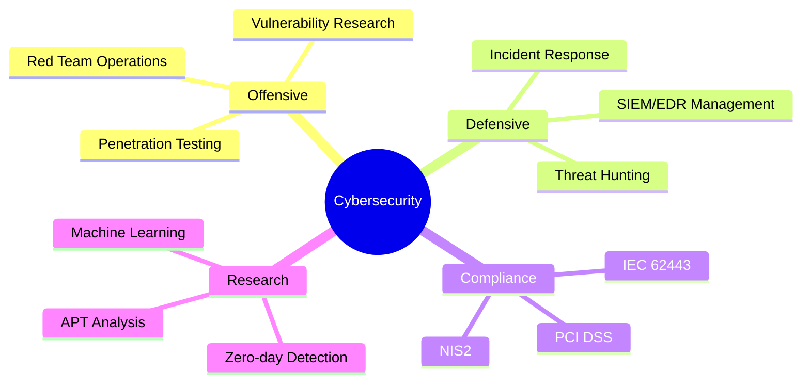

<div align="center">

<!-- Header Banner -->


</div>

<div align="center">
  
[](https://www.linkedin.com/in/albert-ben-barry-1abba21a5/)
[](https://github.com/albert3661)
[](mailto:votre.email@proton.me)

</div>

---

## 👨‍💻 About Me

```python
class CybersecurityConsultant:
    def __init__(self):
        self.name = "Albert Ben Barry"
        self.role = "Cybersecurity Engineer & Security Researcher"
        self.location = "Paris, France"
        self.languages = ["French 🇫🇷", "English 🇬🇧"]
        
    def current_focus(self):
        return {
            "expertise": ["SIEM/EDR Administration", "Threat Hunting", "Vulnerability Analysis"],
            "compliance": ["PCI DSS", "IEC 62443", "NIS2"],
            "research": ["Zero-day Detection", "Machine Learning in Security", "APT Analysis"],
            "certifications": ["CySA+", "CRTA", "Azure SC-900", "Microsoft SC-100", "Google Cybersecurity Certified Professional","Cryptograher","C3SA"]
        }
    
    def achievements(self):
        return [
            "🏆 TOP 60 - Amazon AppSec Challenge CTF 2025 (Europe-Africa)",
            "🔍 National recognition for responsible vulnerability disclosure",
            "📊 30% improvement in security visibility (SIEM deployments)",
            "🛡️ 40% reduction in privilege escalation risks",
        ]
```

<div align="center">
  
### 🎯 **2+ Years Experience | Security Researcher | CTF Player**

</div>

---

## 🛡️ Core Competencies

<table>
<tr>
<td width="50%">

### 🔴 Red Team / Offensive Security
- **Penetration Testing**: Web Apps, Infrastructure, AD
- **Attack Frameworks**: MITRE ATT&CK
- **Exploitation**: Kerberoasting, Pass-the-Hash, AD Enumeration
- **Tools**: Metasploit, Burp Suite, BloodHound, Nmap

</td>
<td width="50%">

### 🔵 Blue Team / Defensive Security
- **SIEM/EDR**: QRADAR, Splunk, Chronicle, CarbonBlack
- **Threat Hunting**: Proactive threat detection
- **Incident Response**: MTTD/MTTR optimization
- **Forensics**: Log analysis, IOC extraction, timeline reconstruction

</td>
</tr>
</table>

---

## 🚀 Recent Achievements

<div align="center">

| Achievement | Impact |
|------------|--------|
| 🎯 **SIEM Optimization** | 30% improvement in security visibility |
| ⚡ **Playbook Automation** | 20% reduction in false positives |
| 🔐 **AD Security Hardening** | 40% decrease in privilege escalation risks |
| 🌐 **PCI DSS Implementation** | Full compliance in SaaS environment |
| 🏆 **Amazon AppSec CTF** | TOP 60 Europe-Africa (2025) |

</div>

---

## 🔧 Tech Stack & Tools

<div align="center">

### Security Operations


### Penetration Testing


### Cloud & Identity


### Programming & Automation


### Operating Systems


</div>

---

## 📊 GitHub Statistics

<div align="center">
  


</div>

<div align="center">
  


</div>

---

## 🎓 Certifications & Education

<div align="center">

| Certification | Year | Focus Area |
|--------------|------|------------|
| 🔴 **Certified Red Team Analyst (CRTA)** | 2025 | Offensive Security |
| 🔵 **Certified Cybersecurity Analyst (CySA+)** | 2025 | Threat Detection & Analysis |
| ☁️ **Microsoft Azure SC-900** | 2025 | Cloud Security Fundamentals |
| 🏗️ **Microsoft SC-100 (In Progress)** | 2025 | Cybersecurity Architecture |
| 🌐 **Certified Network Engineer (CNE)** | 2024 | Network Security |
| 🛡️ **Google Cybersecurity Professional** | 2023 | Security Operations |


</div>

---

## 🔬 Research & Projects

### 🎯 Current Research Focus
**Zero-Day Vulnerability Detection in Critical Environments**
- Advanced ML architecture combining VAE, CAE, and LSTM autoencoders
- Intelligent fuzzing for unknown vulnerability identification
- Behavioral correlation and APT attack pattern analysis
- Proactive detection before exploitation

### 🏗️ Featured Repositories

<div align="center">

[](https://github.com/albert3661/PolyCipherDecryptor)
[](https://github.com/albert3661/JS-endpoint-Extractor)
[](https://github.com/albert3661/Portfolio)


</div>

---

## 📈 Professional Experience Highlights

```yaml
Current_Role:
  Position: "Cybersecurity Engineer - Digital Services"
  Duration: "3+ months"
  Key_Achievements:
    - "SIEM deployment (QRADAR) with 30% visibility improvement"
    - "EDR administration (CarbonBlack) with multi-source correlation"
    - "20% false positive reduction via playbook automation"
    - "PCI DSS implementation in SaaS environment"
    - "Python automation for recurring security tasks"

Previous_Role:
  Position: "Vulnerability Analyst - Energy/Security Sector"
  Duration: "2 years"
  Key_Achievements:
    - "IEC 62443 & NIS2 compliance audits"
    - "Active Directory security assessments"
    - "MITRE ATT&CK framework implementation"
    - "SCADA targeted attack investigation & mitigation"
    - "40% reduction in application security risks"
```

---

## 🎯 Current Focus Areas

<div align="center">



</div>

---

## 💡 Methodology & Frameworks

<div align="center">

| Framework | Application |
|-----------|-------------|
| **MITRE ATT&CK** | Threat mapping & adversary tactics |
| **EBIOS RM** | Risk analysis & management |
| **OWASP** | Web application security testing |
| **PCI DSS** | Payment card data protection |
| **IEC 62443** | Industrial control systems security |
| **NIS2** | Critical infrastructure resilience |

</div>

---

## 🌟 Fun Facts

<div align="center">

🎮 **CTF Enthusiast** - Competing in cybersecurity challenges globally  
🔍 **Bug Bounty Hunter** - Responsible vulnerability disclosure  
🤖 **AI Security Researcher** - Exploring ML applications in cybersecurity  
📚 **Continuous Learner** - Always exploring new attack vectors and defense techniques  
🌐 **Community Contributor** - Open-source security tools developer

</div>

---

## 📫 Let's Connect

<div align="center">

**I'm always open to discussing cybersecurity, collaborating on security research, or exploring new opportunities.**

[](https://www.linkedin.com/in/albert-ben-barry-1abba21a5/)
[](mailto:zcodegeek@pm.me)

</div>

---

<div align="center">

### 💭 *"Security is not a product, but a process."* - Bruce Schneier


</div>
